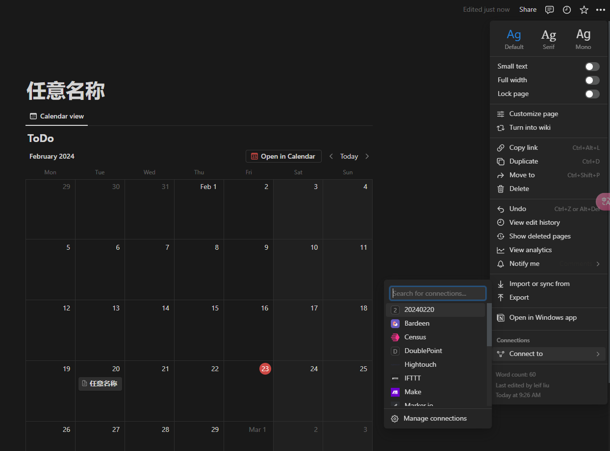
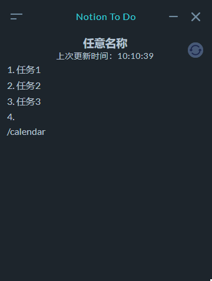

<p align="center">
  
</p>
<p align="center">
  <a >
    
  </a>
  <a >
    
  </a>
  <a >
    
  </a>
</p>

欢迎查看我的产品博客，点击[这里](https://doublepoint.github.io/mainblog/)

# Notion To Do

一个桌面应用程序，用于将Notion中的个人待办以便签的形式在桌面上展示。它旨在让用户能够很方便的看到当日的待办，而无需多次进入Notion页面查看。

本程序尚处于早期阶段，因此欢迎并期待您的反馈和贡献！🌳

> 一个 electron-vue 项目。项目的起因是由于我每天都会用Notion记录我的当日个人待办，当我完成一个任务后要继续下一个任务时，会再次打开Notion，找到我的个人待办的页面，然后查看我的个人待办具体都是什么，往往需要进行多次的鼠标点击。所以如果有个桌面便签能够直接读取到我的个人待办的页面，然后给我显示出来，那就不需要我点击那么多次鼠标来实现这个功能了，所以萌生了开发一个桌面应用的想法。我花费了前后共两个礼拜的时间基本实现了我想要的效果。

## 特征

- 自动从Notion页面获取数据，每10分钟刷新一次
- 包含多个暗色和亮色主题

## 下载

你可以点击[此处](https://doublepoint.github.io/soft/notiontodo/NotionToDo_0.0.1.exe)下载最新版本

## 自制

如果你有开发能力，可以Fork我的项目到本地自行安装
源码地址：[GitHub](https://github.com/DoublePoint/NotionToDo)

## 配置

### 参考视频链接-预览篇

[预览篇](https://www.bilibili.com/video/BV1wH4y1E7qf/?share_source=copy_web&vd_source=0e16a51d26cdd4432b6236fec1e06412)

### 参考视频链接-配置篇
[配置篇](https://www.bilibili.com/video/BV1uy42167tZ/?share_source=copy_web&vd_source=0e16a51d26cdd4432b6236fec1e06412)

<!-- <iframe src="https://www.bilibili.com/video/BV1wH4y1E7qf/?share_source=copy_web&vd_source=0e16a51d26cdd4432b6236fec1e06412" scrolling="no" border="0" frameborder="no" framespacing="0" 
style="width:100%;height:400px;"
allowfullscreen="true"> </iframe>

### 参考视频链接-配置篇

<iframe src="https://www.bilibili.com/video/BV1uy42167tZ/?share_source=copy_web&vd_source=0e16a51d26cdd4432b6236fec1e06412" scrolling="no" border="0" frameborder="no" framespacing="0" 
style="width:100%;height:400px;"
allowfullscreen="true"> </iframe> -->
### 详细配置

1. 获取Notion Secret：跳转到[https://www.notion.so/my-integrations](https://www.notion.so/my-integrations),点击New integration,名称任意（如20240220），并获取Internal Integration Secret

   
2. 新建一个Notion Page(名称任意)，创建Calendar View(名称为ToDo),并Connect To 20240220（在第一步创建的Intergration）
3. 录入第一步的Internal Integration Secret和第二步的Page Url

   
4. 重启程序，查看当日待办，预览效果，如下图

   

## 当前的限制

- 个人能力有限，只提供了Windows版本的应用程序
- 当前支持标签如下


  | 标签               | 是否支持 |
  | -------------------- | ---------- |
  | Heading1           | 🆗       |
  | Heading2           | 🆗       |
  | ToDo               | 🆗       |
  | paragraph          | 🆗       |
  | bulleted_list_item | 🆗       |
  | divider            | 🆗       |
  | numbered_list_item | 🆗       |

### 参考

本产品的开发参考了以下内容

1. [pomotroid](https://github.com/Splode/pomotroid)
2. [vue-notion-render](https://github.com/notionblog/vue-notion-render)

### Build Setup

```bash
# install dependencies
npm install

# serve with hot reload at localhost:9080
npm run dev

# build electron application for production
npm run build


```
