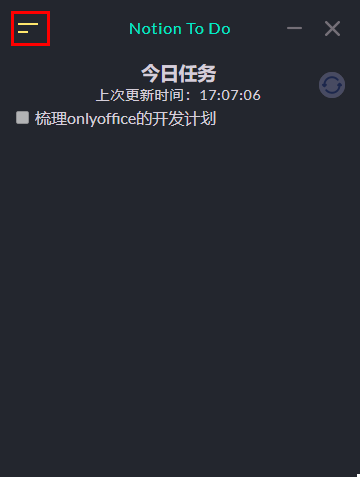
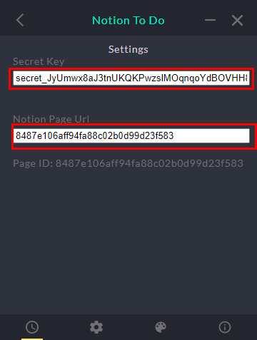

<p align="center">
  
</p>

<p align="center">
  <a >
    
  </a>
  <a >
    
  </a>
  <a >
    
  </a>
</p>

如果你想查看我的产品博客，请点击这里[查看](https://doublepoint.github.io/mainblog/)

# Notion To Do

一个桌面应用程序，用于将Notion中的个人待办以便签的形式在桌面上展示。它旨在让用户能够很方便的看到当日的待办，而无需多次进入Notion页面查看。

本程序尚处于早期阶段，因此欢迎并期待您的反馈和贡献！🌳

## 特征

- 自动从Notion页面获取数据，每10分钟刷新一次
- 包含多个暗色和亮色主题

## 下载

你可以点击[此处](https://doublepoint.github.io/soft/notiontodo/NotionToDo_0.0.1.exe)下载最新版本

## 自制

如果你有开发能力，可以Fork我的项目到本地自行安装

## 配置

1. 注册Notion Secret


2. 新建一个Notion Page或者Clone我的Notion Page
3. 录入Page Url
4. 查看当日待办

## 当前的限制

- 个人能力有限，只提供了Windows版本的应用程序
- 当前支持标签如下


  | 标签               | 是否支持 |
  | -------------------- | ---------- |
  | Heading1           | 🆗       |
  | Heading2           | 🆗       |
  | ToDo               | 🆗       |
  | paragraph          | 🆗       |
  | bulleted_list_item | 🆗       |
  | divider            | 🆗       |
  | numbered_list_item | 🆗       |

> 一个 electron-vue 项目。项目的起因是由于我每天都会用Notion记录我的当日个人待办，当我完成一个任务后要继续下一个任务时，会再次打开Notion，找到我的个人待办的页面，然后查看我的个人待办具体都是什么，往往需要进行多次的鼠标点击。所以如果有个桌面便签能够直接读取到我的个人待办的页面，然后给我显示出来，那就不需要我点击那么多次鼠标来实现这个功能了，所以萌生了开发一个桌面应用的想法。我花费了前后共两个礼拜的时间基本实现了我想要的效果。


### 参考

本产品的开发参考了以下内容

1. [pomotroid](https://github.com/Splode/pomotroid)
2. [vue-notion-render](https://github.com/notionblog/vue-notion-render)

### Build Setup

```bash
# install dependencies
npm install

# serve with hot reload at localhost:9080
npm run dev

# build electron application for production
npm run build


```
